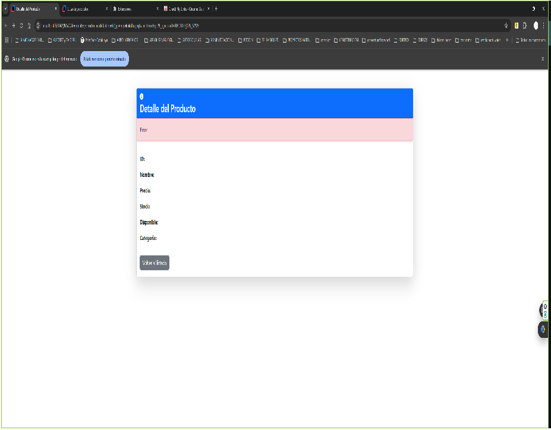

# 🛒 Gestión de Productos - kirgoDev

Aplicación web desarrollada con **Spring Boot**, **Thymeleaf** y Bootstrap 5**, que permite gestionar productos de una tienda: ver listado, detalles, y futuras funcionalidades de edición, creación y eliminación.

---
## 📸 Capturas de Pantalla

### 📋 Vista del listado de productos

### 🔍 Vista de detalle del producto 

---

## 🛠️ Tecnologías Usadas

- ⚙️ Java 24
- ☕ Spring Boot 3.x
- 🧩 Spring Data JPA
- 🌱 Hibernate + JPA
- 💎 Thymeleaf
- 🎨 Bootstrap 5
- 🐘 H2 / MySQL (Desarrollo / Despliegue)
- 🧪 Junit 5 (test futuros)
---

## 📁 Estructura del Proyecto

    src/
        |----main/
        |----java/
        |        |----com/
        |                |----KirgoDev/
        |                |            |----controllers/
        |                |            |              |---------CategoriaController
        |                |            |              |---------ErrorControllerCustom
        |                |            |              |---------ProductoController
        |                |            |----dto/
        |                |            |       |----ProductoFiltroDTO
        |                |            |----entities/
        |                |            |           |----Carrito
        |                |            |           |----Categoria
        |                |            |           |----Producto
        |                |            |----repositories/
        |                |                            |----CategoriaRepository
        |                |                            |----ProductoRepository
        |                |                            |----ProductoRepositoryCustom
        |                |                            
        |                |-----------Main
        |                |----resources/
        |                |             |-----templates/
        |                |             |              |----404.html
        |                |             |              |----categoria-list.html
        |                |             |              |----error.html 
        |                |             |              |----info.html
        |                |             |              |----producto-list.html
        |                |             |              |----producto-detail.html
        |                |             |              |----producto-edit.html
        |                |             |----Application.propierties
        |----test/
        |        |----<futuros archivos de test>
        |----capturas/
        |            |----producto-list.png
        |            |----producto-datail.png
        |            |----producto-edit.png
        |            |----producto-delete.png
